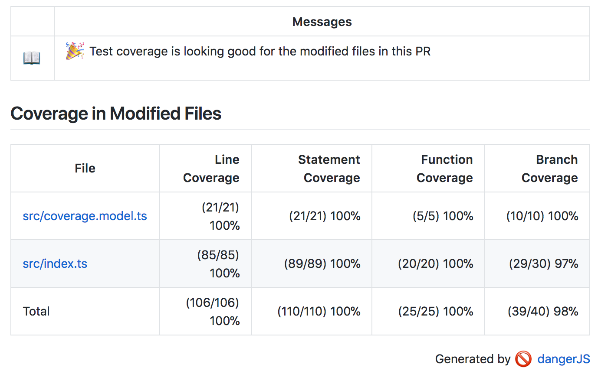

# danger-plugin-istanbul-coverage

[](https://travis-ci.org/darcy-rayner/danger-plugin-istanbul-coverage)
[](https://badge.fury.io/js/danger-plugin-istanbul-coverage)
[](https://github.com/semantic-release/semantic-release) [](https://greenkeeper.io/)

> Danger.js plugin for monitoring code coverage on changed files.

<p align="center">
  </img>
</p>

## Usage

Install:

```sh
yarn add danger-plugin-istanbul-coverage --dev
```

At a glance:

```js
// dangerfile.js
import { schedule } from "danger"
import { istanbulCoverage } from "danger-plugin-istanbul-coverage"

schedule(istanbulCoverage()) // Use default configuration

schedule(istanbulCoverage({
  // Set a custom success message
  customSuccessMessage: "Congrats, coverage is good",

  // Set a custom failure message
  customFailureMessage: "Coverage is a little low, take a look",

  // How to sort the entries in the table
  entrySortMethod: "alphabetical" // || "least-coverage" || "most-coverage" || "largest-file-size" ||"smallest-file-size" || "uncovered-lines"

  // Add a maximum number of entries to display
  numberOfEntries: 10,

  // The location of the istanbul coverage file.
  coveragePath: "./coverage/coverage-summary.json",
  // Alternatively, if you have multiple coverage summaries, you can merge them into one report
  coveragePaths: ["./dir1/coverage-summary.json", "./dir2/coverage-summary.json"]
  // You can also specify the format, instead of letting it be inferred from the file name
  coveragePath: { path: "./coverage/lcov.info", type: "lcov" /* ||  "json-summary" */}

  // Which set of files to summarise from the coverage file.
  reportFileSet: "all", // || "modified" || "created" || "createdOrModified"

  // What to do when the PR doesn't meet the minimum code coverage threshold
  reportMode: "message", // || "warn" || "fail"

  // Minimum coverage threshold percentages. Compared against the cumulative coverage of the reportFileSet.
  threshold: {
    statements: 100,
    branches: 100,
    functions: 100,
    lines: 100,
  }
}))
```

This plugin requires the 'json-summary' or 'lcov' report modes be enabled with Istanbul. Make sure Danger runs after your unit tests in your CI workflow.

## FAQ

### What test runners does this work with?

Anything that integrates with [Istanbul](https://www.npmjs.com/package/istanbul), or produces output in the (lcov)[https://linux.die.net/man/1/lcov] format. Istanbul is test runner agnostic, and can be integrated with anything written in node. Some test runners already integrate Istanbul, for instance [Jest](https://jestjs.io/docs/en/cli.html#coverage)  bundles it internally. Helper integrations exists for [Jasmine](https://www.npmjs.com/package/jasmine-istanbul-reporter) and other libraries.

### Why should my team see code coverage stats in their PRs?

It is important to note that test coverage and test quality aren't the same thing. However, low test coverage, particularly on new or modified code, is usually sympomatic of poor test culture on a team. Surfacing test coverage statistics on your PRs can helps increase accountability on the team, and encourages discussion on why certain things were or weren't tested. Tests still need to be reviewed and held up to the same standards as any piece of code. Focusing too much on increasing code coverage, while ignoring test quality can create technical debt in the form of junk tests. So use these stats as a jumping off point for conversations, not a rubber stamp.

## Changelog

See the GitHub [release history](https://github.com/darcy-rayner/danger-plugin-istanbul-coverage/releases).

## Contributing

See [CONTRIBUTING.md](CONTRIBUTING.md).
